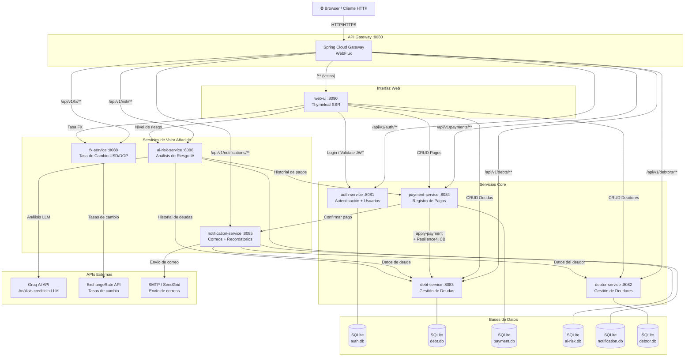

# Arquitectura del Sistema — Debt Manager Microservices

## Diagrama General



---

## Inventario de Servicios

| Servicio | Puerto | Responsabilidad | Base de Datos | Llama a |
|----------|--------|-----------------|---------------|---------|
| **api-gateway** | 8080 | Enrutamiento, punto único de entrada | — | Todos los servicios |
| **auth-service** | 8081 | Autenticación JWT + gestión de usuarios del sistema | SQLite | — |
| **debtor-service** | 8082 | CRUD de deudores (personas con deudas) | SQLite | — |
| **debt-service** | 8083 | CRUD de deudas, KPIs del dashboard | SQLite | — |
| **payment-service** | 8084 | Registro de pagos, historial | SQLite | debt-service, notification-service |
| **notification-service** | 8085 | Emails de confirmación y recordatorios por vencimiento | SQLite | debtor-service, debt-service |
| **ai-risk-service** | 8086 | Calcula nivel de riesgo (reglas + IA Groq) | SQLite | debt-service, payment-service, Groq API |
| **fx-service** | 8088 | Conversión de moneda USD ↔ DOP | — | ExchangeRate API |
| **web-ui** | 8090 | Interfaz web Thymeleaf SSR | — | auth, debtor, debt, payment, fx, ai-risk |

---

## Patrones Técnicos

| Patrón | Donde se aplica |
|--------|----------------|
| **JWT Auth** | Todos los servicios validan `Authorization: Bearer <token>` |
| **Circuit Breaker (Resilience4j)** | payment-service → debt-service |
| **OpenFeign** | ai-risk-service, notification-service, web-ui |
| **Flyway Migrations** | Todos los servicios con SQLite/H2 |
| **TraceId propagation** | Todos los servicios via `X-Trace-Id` header |
| **Actuator Health** | `/actuator/health` en cada servicio |
| **Swagger / OpenAPI** | `/swagger-ui/index.html` en cada servicio |

---

## Estructura de Respuesta Estándar

Todas las APIs siguen el mismo contrato definido en `common-lib`:

```json
// Éxito
{
  "success": true,
  "timestamp": "2026-03-16T15:00:00Z",
  "traceId": "4ec7b46d",
  "data": { ... }
}

// Error
{
  "success": false,
  "timestamp": "2026-03-16T15:00:00Z",
  "traceId": "4ec7b46d",
  "error": {
    "code": "AUTH_401",
    "message": "Authentication failed",
    "details": {}
  }
}
```
