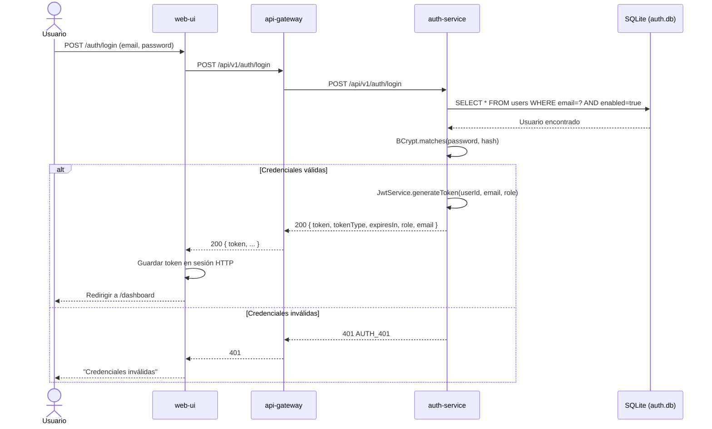
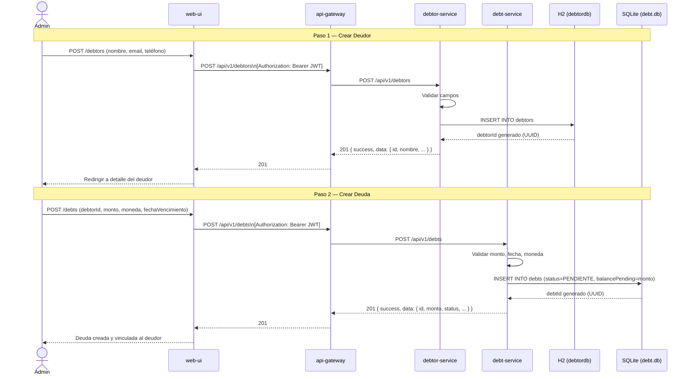
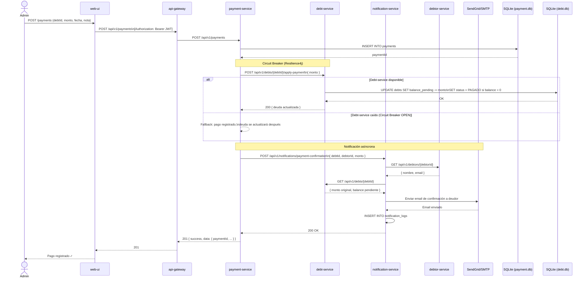
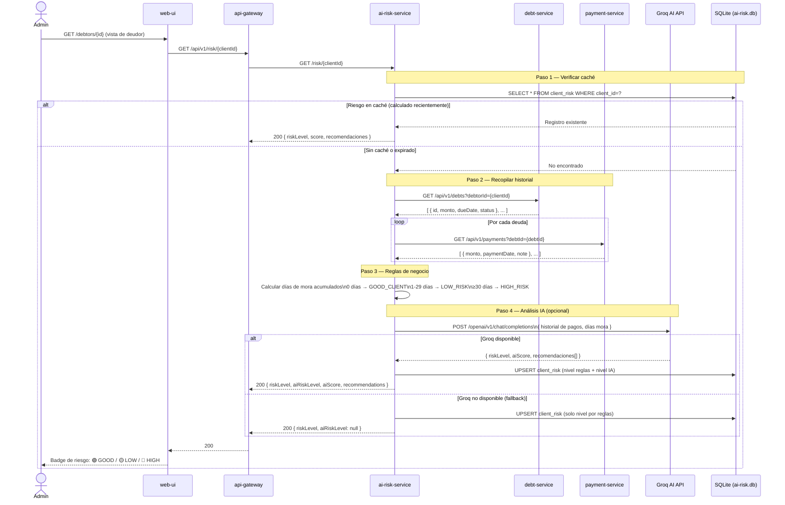
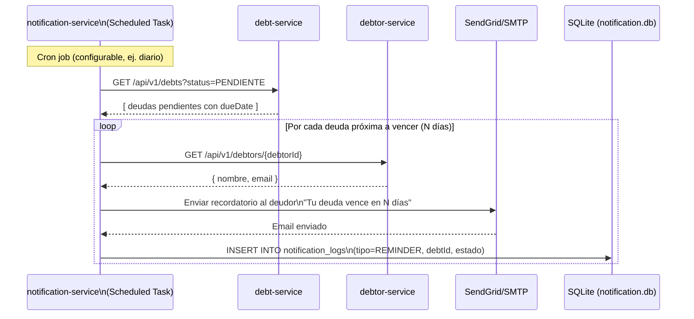

# Flujos de Interacción — Debt Manager Microservices

Cada diagrama muestra el flujo de punta a punta para los casos de uso principales del sistema.

---

## Flujo 1: Login de Usuario

El usuario ingresa credenciales. El sistema valida contra la base de datos de `auth-service` y devuelve un JWT.



---

## Flujo 2: Crear Deudor y Registrar Deuda

El administrador registra un nuevo deudor y le asigna una deuda con fecha de vencimiento.



---

## Flujo 3: Registrar Pago (flujo más complejo)

El pago actualiza el saldo de la deuda y dispara una notificación por correo. Incluye circuit breaker.



---

## Flujo 4: Cálculo de Riesgo del Cliente (IA)

Combina reglas de negocio con análisis de lenguaje natural via Groq (LLM externo). Tiene fallback si Groq no está disponible.



---

## Flujo 5: Recordatorio Automático por Vencimiento

El `notification-service` tiene un scheduler que corre periódicamente y detecta deudas próximas a vencer.



---

## Resumen de Dependencias entre Servicios

```
web-ui ──────────────► auth-service
       ──────────────► debtor-service
       ──────────────► debt-service
       ──────────────► payment-service
       ──────────────► fx-service
       ──────────────► ai-risk-service

payment-service ─────► debt-service          [Resilience4j Circuit Breaker]
                ─────► notification-service

notification-service ► debtor-service
                     ► debt-service

ai-risk-service ─────► debt-service          [OpenFeign + Circuit Breaker]
                ─────► payment-service        [OpenFeign + Circuit Breaker]
                ─────► Groq API (externo)     [Fallback si no disponible]

fx-service ──────────► ExchangeRate API (externo)
```
